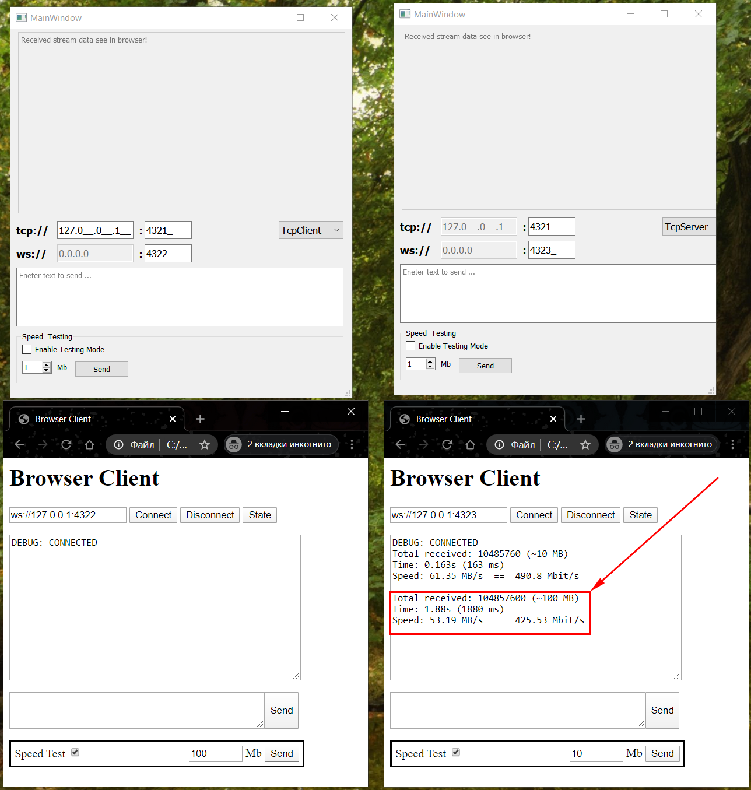

# InterPcCommunication
(Tcp or Udp) Server and Client with delivering stream data to browser through WebSockets 

### WIN32 build
You can download builde version here [here](./build_win32)

### Vide Example of working app
Download [video](./docs/Example.mp4) to see how it works

### Screenshot of working app

Screen 1. Two instance of application: one is clint and other is server. Two browser pages

