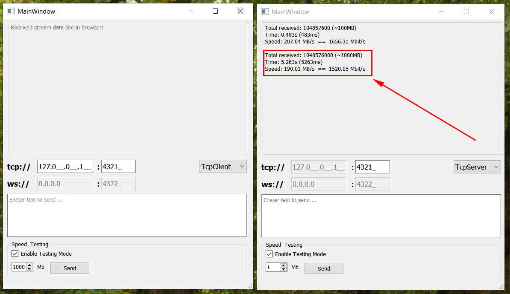

# InterPcCommunication
(Tcp or Udp) Server and Client with delivering stream data to browser through WebSockets 

### WIN32 build
You can download WIN32 build [here](./build_win32)

### Vide Example of working app
Download [video](./docs/Example.mp4) to see how it works
                                               
### Architecture of this application

Screen 1. Architecture of multithreaded application 
  

### Screenshot of Benchmark (Browser -> WebsocketServer -> TCPServer -> TCPClient -> WebsocketServer -> Browser)

Screen 2. Two instance of application: one is clint and other is server. Two browser pages and benchmark result
  

### Screenshot of Benchmark (TCPClient -> TCPServer)

Screen 2. Two instance of application: one is clint and other is server and benchmark result for TCPserver/TCPClient 
  

### To sum up...
##### Qt TCP Server/Client provide ~1.5 Gbit/s in multithreaded mode
    Total received: 1048576000 (~1000 MB)
    Time: 5.263s (5263 ms)
    Speed: 190.01 MB/s  ==  1520.05 Mbit/s  ==  ~1.5 Gbit/s

##### Hardware Characteristics
    CPU: Intel® Core™ i3-7100U (2.4 GHz, 3MB L3 Cache)
    MEM: 8GB DDR4

    (Test only in memory, so SSD/HDD is not used)
